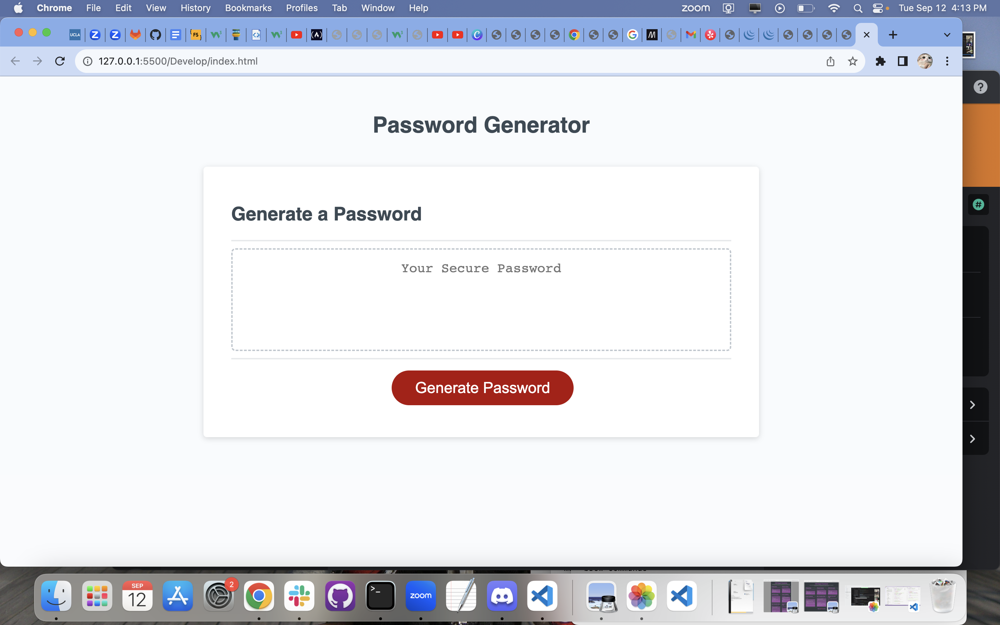
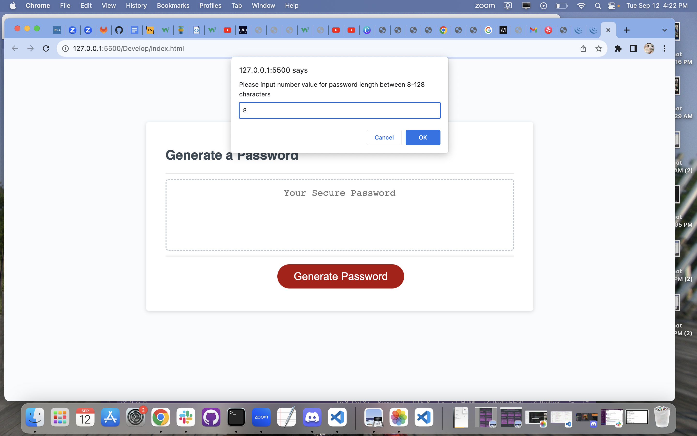
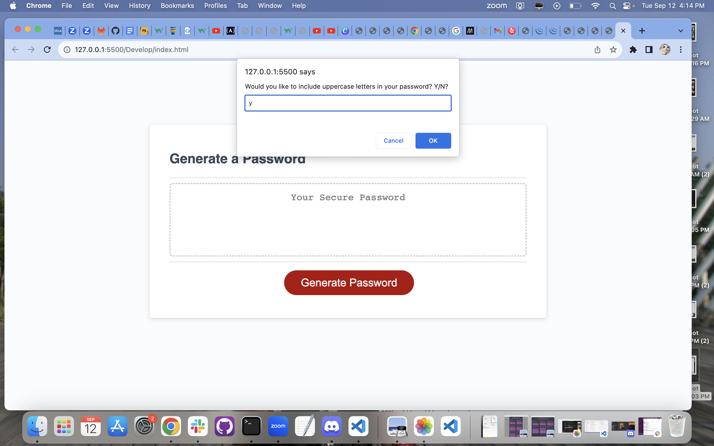
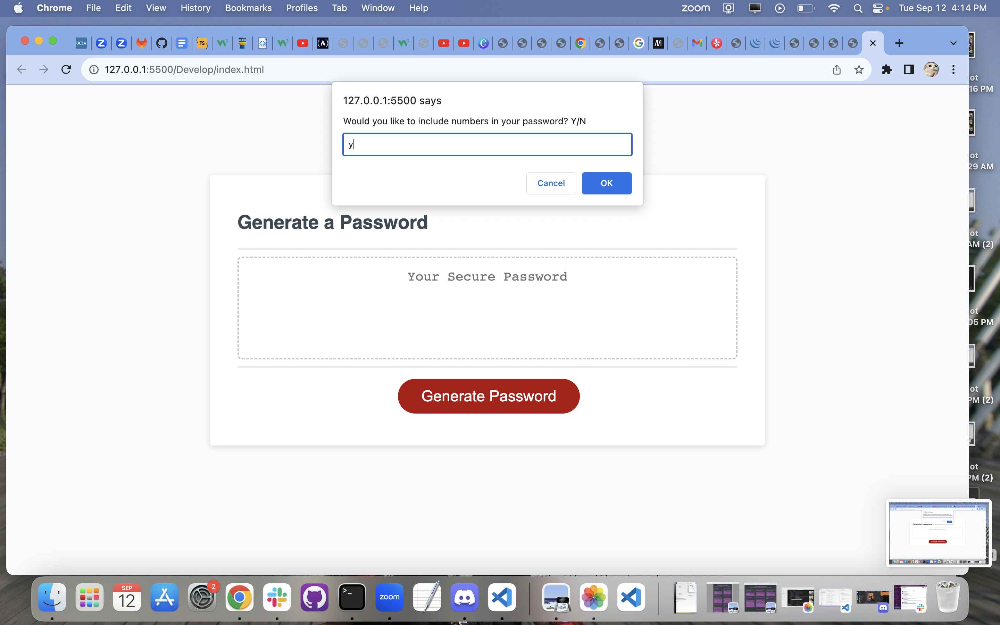
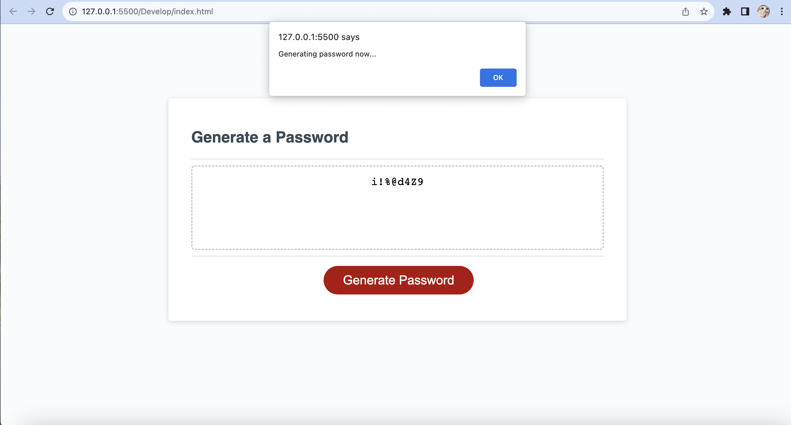
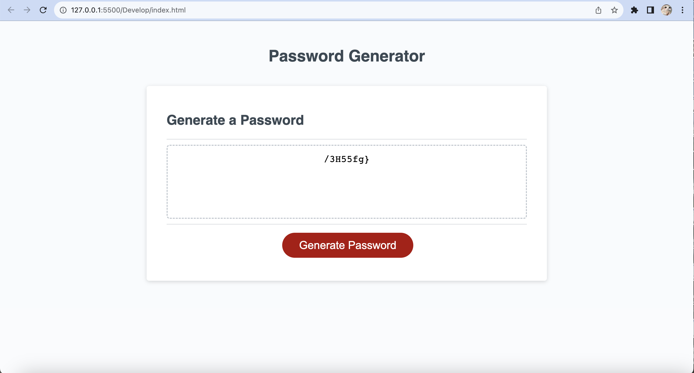

# Password Generator

This password generator was created using Javascript and building off code that was provided in class.

## Installation

N/A Webpage is viewable online

## Usage
This is the webpage displayed at full screen, with a Generate Password button prompting users to press
    ```md
    

Pressing the generate password button will open a prompt asking for users to input a number between 8-128 to generate the length of the password
    ```md
    

Confirming will bring you to the next prompt asking users if they would like to include uppercase letters in their password
    ```md
    

Confirming will bring you to the next prompt asking users if they would like to include lowercase letters in their password
    ```md
    


Confirming will bring you to the next prompt asking users if they would like to include special characters in their password
    ```md
    

Confirming will bring you to the next prompt asking users if they would like to include numbers in their password
    ```md
    

Confirming generates the message "generating password now..." when user hits ok, 
    ```md
    

Password with given parameters is displayed!
    ```md
    

## License

[MIT](https://choosealicense.com/licenses/mit/)

    ```

## Credit
Readme.md Guide(https://coding-boot-camp.github.io/full-stack/github/professional-readme-guide)
CSS Tutorials (https://www.w3schools.com/)


## How to Contribute

If you created an application or package and would like other developers to contribute it, you can include guidelines for how to do so. The [Contributor Covenant](https://www.contributor-covenant.org/) is an industry standard, but you can always write your own if you'd prefer.

